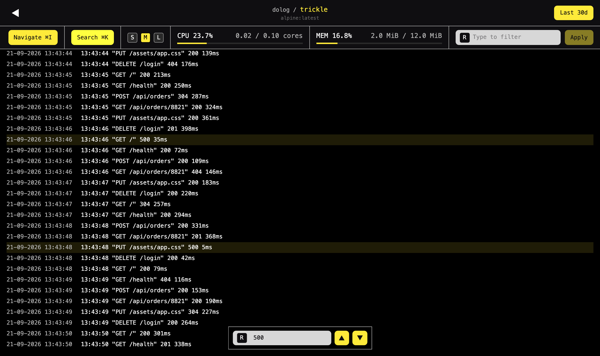

# Dolog: Simple Docker Log Viewer for Self-Hosters



## Summary

Dolog is a simple Docker log viewer for self-hosters.

It shows you which containers are running on your Docker host, what they're using and what they're saying, without agents, sidecars or changes to the containers themselves. Dolog keeps what it has seen, so the logs of a container are still there after it's been restarted or replaced. Dolog has been designed for Docker Compose setups.

Start the Dolog container with a mount of the Docker socket, and receive:

- live logs for every container
- retention mechanics with support for custom policies per container
- built-in throttling to protect against chatty containers
- search and filtering functionality
- CPU and memory usage, per container and for the host
- webhook alerts based on log patterns or throughput thresholds
- ... and much more!

## Quickstart

```sh
docker run --rm \
  -p 3000:3000 \
  -v /var/run/docker.sock:/var/run/docker.sock:ro \
  butterhosting/dolog
```

## Documentation

Please visit [www.butterhost.ing/dolog](https://www.butterhost.ing/dolog) for the full documentation, covering deployment, configuration, retention and throttling policies, alerting, tips, tricks and more.
